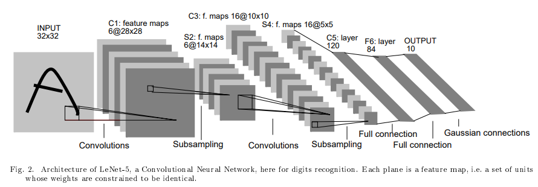

# LeNet-5 🏋🏻

- `LeNet` is a convolutional neural network structure proposed by `Yann LeCun` et al. in **`1998`**.

> Here's the associated [research paper](./Lecun98.pdf), but some of the ideas discussed in the paper are not widely used today, like, today using `softmax` for output is more preferred, also, training on multiple devices (distributed training) is handled completely differently in the paper, which is not relevant nowadays. Also, some other optimizations have been used, which don't make significant difference.

- LeNet is a classic convolutional neural network employing the use of convolutions, pooling and fully connected layers.

> ...
>
> *SubSampling is `Pooling`.

- It was used for the handwritten digit recognition task with the MNIST dataset.

- **The architectural design served as inspiration for future networks such as `AlexNet` and `VGG`.**

---

## Special note ❤️📝

- I struggled a lot while training `LeNet` on `MNIST` dataset 😢.
- My model was not even training, `loss in each epoch` seemed to stuck at `0.57` and even after 20 epochs, accuracy was merely 50%.
- Finally, after 1-2 hours of asking `Bard` & `ChatGPT`, I figured out, the issue was with the `learning rate of the optimizer`.
- `MNIST` dataset is very small and needs very small `learning rate (0.0001)`. Default `lr of adam (0.001)` is much higher (10 times), and I was initially trying with `learning rate of 0.1`. 🤓

- Anyways, I hope this small note on my experience will help you remember the concept of `having very high learning rate`. I studied about this while taking `Andrew NG sir's ML & DL course`. But, **`nothing teaches you more than hours of irritation.`** 🏋🏻
- Have a good day! 🥳