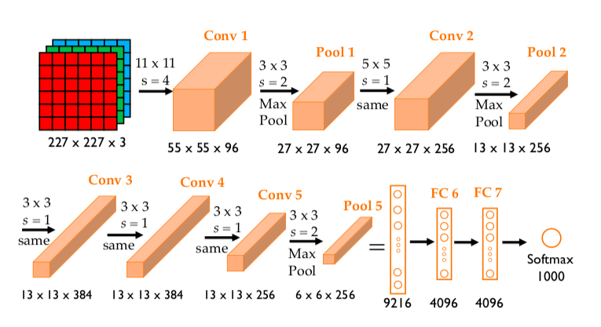
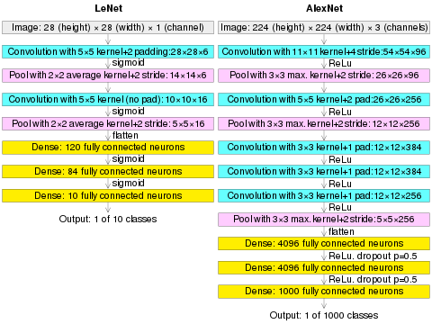

# AlexNet 😈

- **AlexNet** is the name of a convolutional neural network (CNN) architecture, designed by **Alex Krizhevsky** in collaboration with **Ilya Sutskever** and **Geoffrey Hinton**, who was Krizhevsky's Ph.D. advisor at the University of Toronto.

- AlexNet competed in the ImageNet Large Scale Visual Recognition Challenge on September 30, 2012.

- The network achieved a top-5 error of 15.3%, more than 10.8 percentage points lower than that of the runner up.

- The original paper's primary result was that the depth of the model was essential for its high performance, which was computationally expensive, but made feasible due to the utilization of graphics processing units (GPUs) during training.

### Comparison with LeNet 🤭

>>> Give special attention on the `dropout layers` in FC layers

 

- In this model, the **depth of the network was increased** in comparison to LeNet-5.
- Also, Relu was used as activation function. Earlier models used to use `tanh` or `sigmoid`. They found out that using the **relu as an activation function accelerated the speed of the training process by almost six times**. 

- They also used the **dropout layers, that prevented their model from overfitting**.

- The model is trained on the Imagenet dataset. The Imagenet dataset has almost 14 million images across a thousand classes.