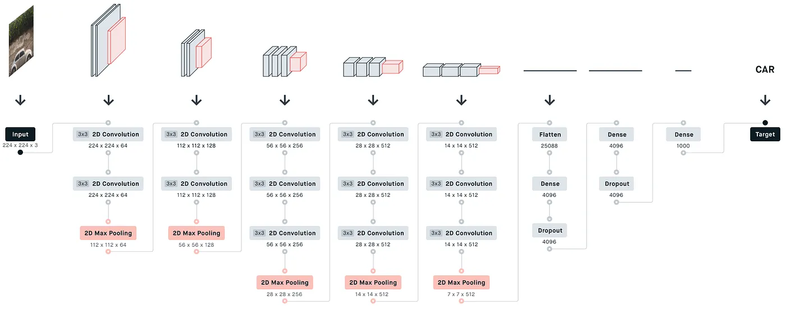

# VGG-16 🚀

[VGG Very Deep Convolutional Networks (VGGNet)](./VGG-16%20paper.pdf)

- VGG stands for **Visual Geometry Group**;
- It is a standard deep Convolutional Neural Network (CNN) architecture with multiple layers.
- The “deep” refers to the number of layers with VGG-16 or VGG-19 consisting of 16 and 19 convolutional layers.

- The VGG16 model achieves almost 92.7% top-5 test accuracy in ImageNet.

- It `replaces the large kernel-sized filters with several 3×3 kernel-sized filters one after the other, thereby making significant improvements over AlexNet`.

---

### What is VGG-19?

The concept of the VGG19 model (also VGGNet-19) is the same as the VGG16 except that it supports 19 layers.

- The “16” and “19” stand for the number of weight layers in the model (convolutional layers).
- This means that VGG19 has three more convolutional layers than VGG16.

---

### Architecture of VGG-16

- The architecture of VGG-16 is quite simple, and it uses smaller (3 * 3) convolutional layers (unlike (11 * 11) conv layers in AlexNet). But, the model is really large and it has a lot of parameters (approx 138 millions).