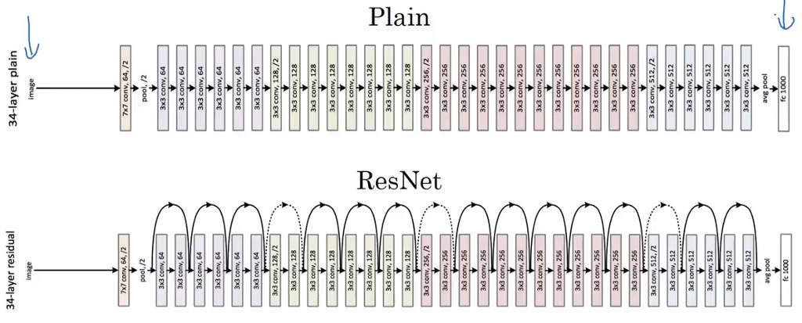
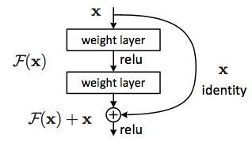

# ResNet 😇



- [Research paper](./ResNet.pdf)
- [PyTorch usage]()
- **Residual Network (ResNet)** is a deep learning model used for computer vision applications.
> It is a Convolutional Neural Network (CNN) architecture *designed to support hundreds or thousands of convolutional layers*.
> 
> **Previous CNN architectures were not able to scale** to a large number of layers, which resulted in limited performance. However, when adding more layers, researchers faced the **“vanishing gradient” problem**.

```diff
- Neural networks are trained through a backpropagation process that relies on gradient descent,
- shifting down the loss function and finding the weights that minimize it.
+
- If there are too many layers, repeated multiplications will eventually reduce the gradient until it “disappears”,
- and performance saturates or deteriorates with each layer added.
+
@ Concept of Skip-connections
+
+ ResNet provides an innovative solution to the vanishing gradient problem, known as **“skip connections”**.
+ ResNet stacks multiple identity mappings (convolutional layers that do nothing at first),
+ skips those layers, and reuses the activations of the previous layer.
+ Skipping speeds up initial training by compressing the network into fewer layers. 
```
---

### Residual Block 🎁



- To be able to add `output from second last layer` to the `current input before applying Relu`, both of them needs to be of same shape.
- For this, `same padding convolution (applying padding such that size doesn't reduces)` is applied.

---

