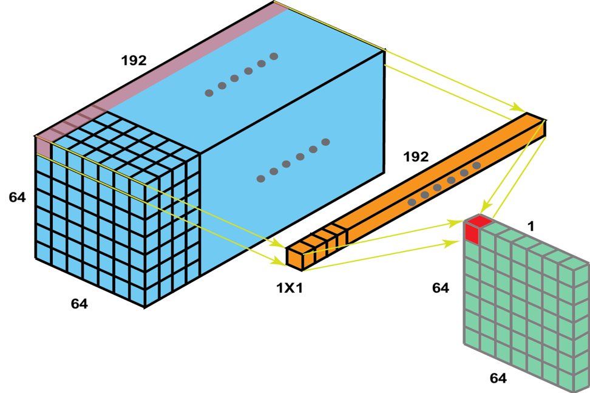

# Inception Network (GoogLeNet) 🫡

- [Research Paper](./InceptionNet.pdf)
- Also called, `GoogLeNet` as a homage to `LeNet architecture`.

- Why bother `which layer should I apply (convolutional, or pooling), or what should be the kernel size of the conv layer`. 
- **Apply them all, and in as many shapes as you wish.** 😎🤓
- But, Won't this make it too computationally intensive?
- Let's use then (1 X 1) convolution.

---

## (1 X 1) Convolution

- It is applied to `reduce the number of channels in the input layer to 1`.
- If we apply `n` number of (1 X 1) convolutions, we can `reduce the input to n channels.`

- It is mostly used when we intend to diminish number of calculations.

---

## Inception Module 🙂

- Coming back to, `let's apply all the filters/layers at once`, we can use (1 X 1) convolutions to reduce the calculations and then, apply different neural network layers and append/stack them.
- To be able to stack them along channels, they all should have same `height & width`, so we need to use `same padding` in case.

---

### Finally, the complete GoogLeNet 

- You can see multiple output layers coming out from side-branches in the middle of the model.
- They are also having `softmax function` and are trying to predict the output.
- **They will also try to be correct, and will use `backpropagation` for improvement, this will have a `regularization effect on the model`**.